# MCP Image Generator (Uncensored)

A self-hosted [Model Context Protocol](https://modelcontextprotocol.io) server that creates and edits images
with the **uncensored Qwen-Image-2.1** model on your own computer. It runs in Docker, on an NVIDIA GPU or on
the CPU, and any MCP client on your network can use it over Streamable HTTP.

The default model is an uncensored build of Qwen-Image-2.1 with no built-in content filter. To use the
standard model instead, set `model.variant: base` in `config.yaml`.

- **Text to image** in any size or aspect ratio, up to about 4 megapixels (2048x2048)
- **Image editing**: change, add or remove things, restyle, or combine up to 10 images
- **Transparent backgrounds** (RGBA PNG) and **background removal**
- **Seamless tileable textures**, including height and normal maps that stay seamless
- **360 panoramas** with a built-in 360 viewer
- **Upscaling** 2x or 4x, and **watermark removal**
- Models download automatically on the first start

## Examples

All images below were made by this server with the default quality settings. The prompts are listed under the gallery.

<table>
<tr>
<td width="50%">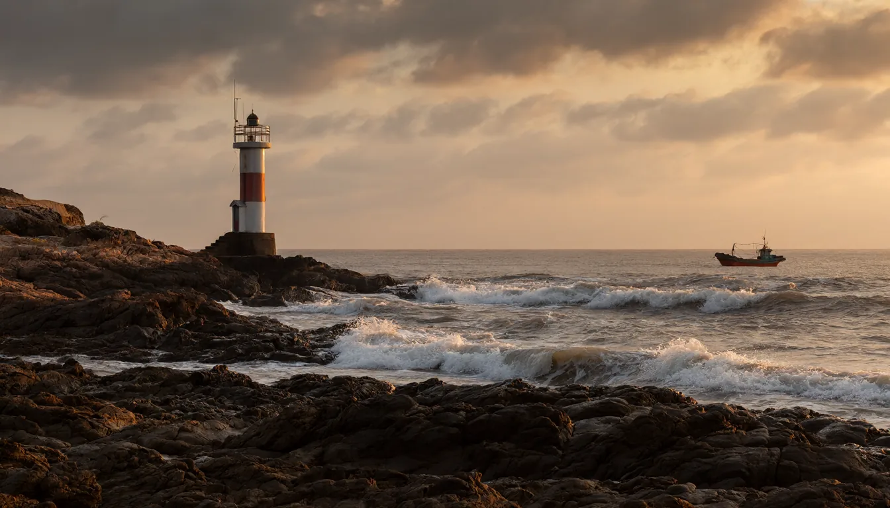<br>
<b>Text to image</b></td>
<td width="50%">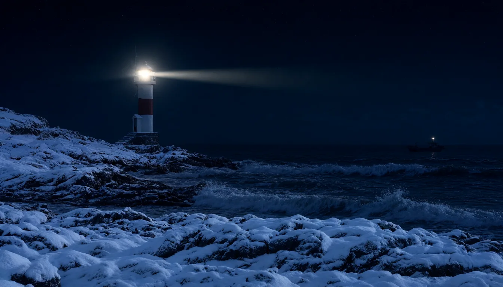<br>
<b>Edit</b>: the image on the left, made into a snowy winter night</td>
</tr>
<tr>
<td>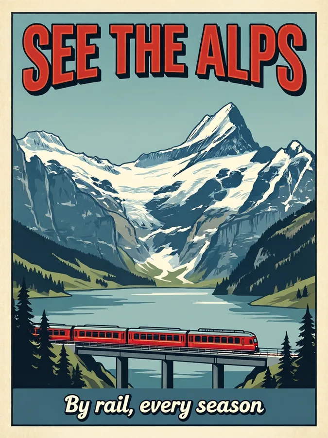<br>
<b>Text in images</b>: text in quotes is written as given</td>
<td>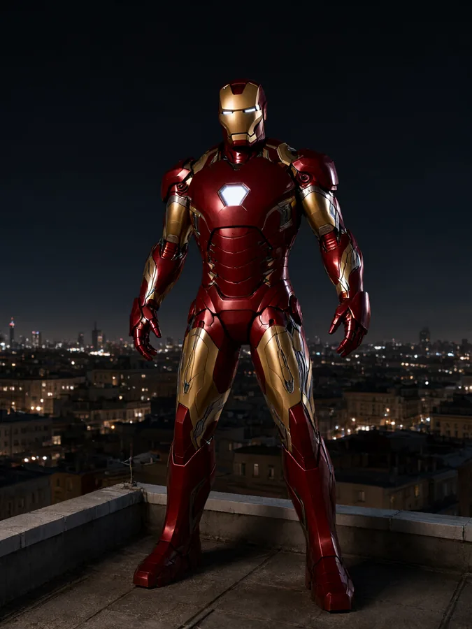<br>
<b>Uncensored</b>: famous characters, which many image services refuse</td>
</tr>
<tr>
<td><br>
<b>Icon with no background</b> (transparent PNG)</td>
<td>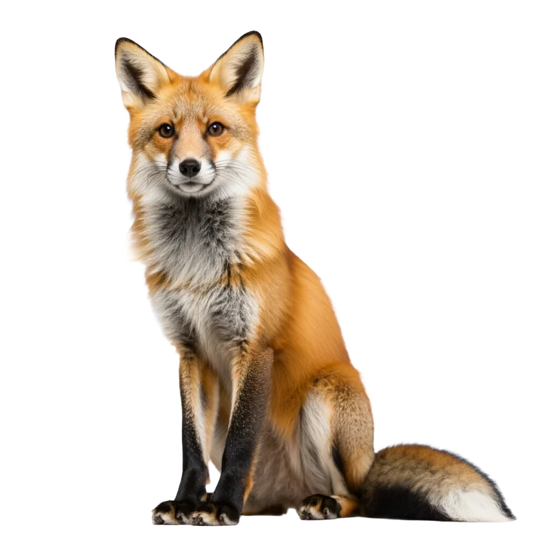<br>
<b>Transparent background</b></td>
</tr>
</table>

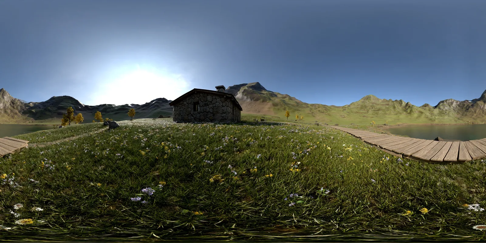<br>
<b>360 panorama</b>, opened in the built-in 360 viewer from the link in the result

### Seamless textures

Each texture below is one tile (top). Repeated 3x3 (bottom), it shows no seams.

<table>
<tr>
<td width="33%">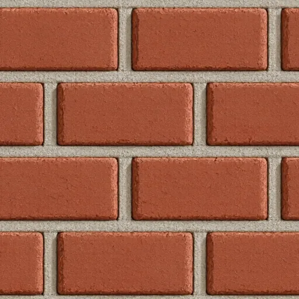</td>
<td width="33%">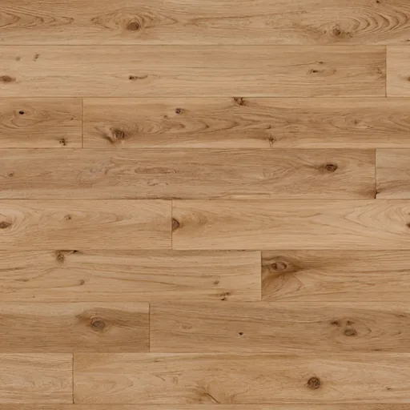</td>
<td width="33%">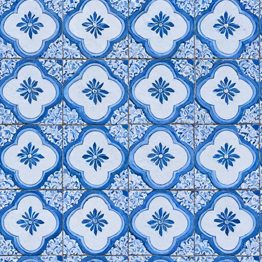</td>
</tr>
<tr>
<td>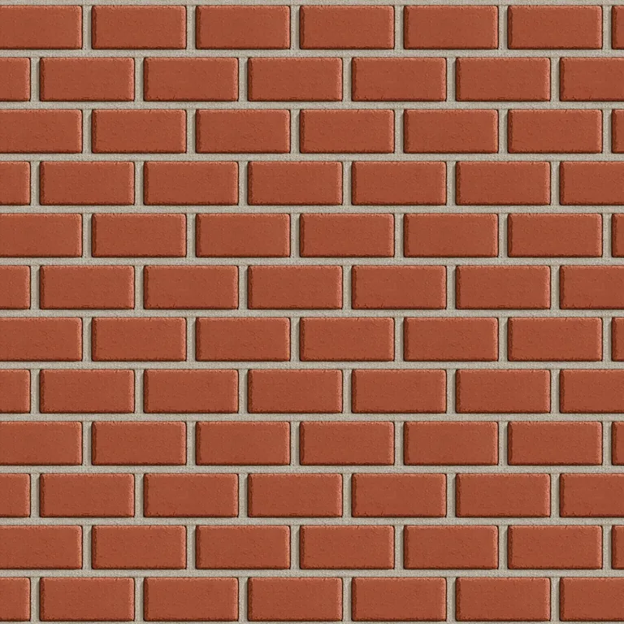</td>
<td>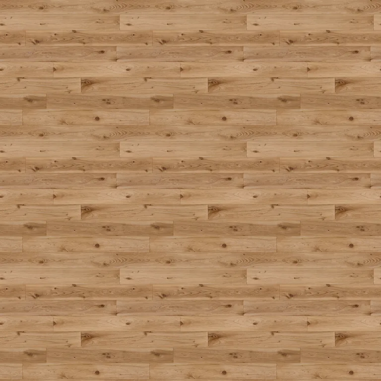</td>
<td>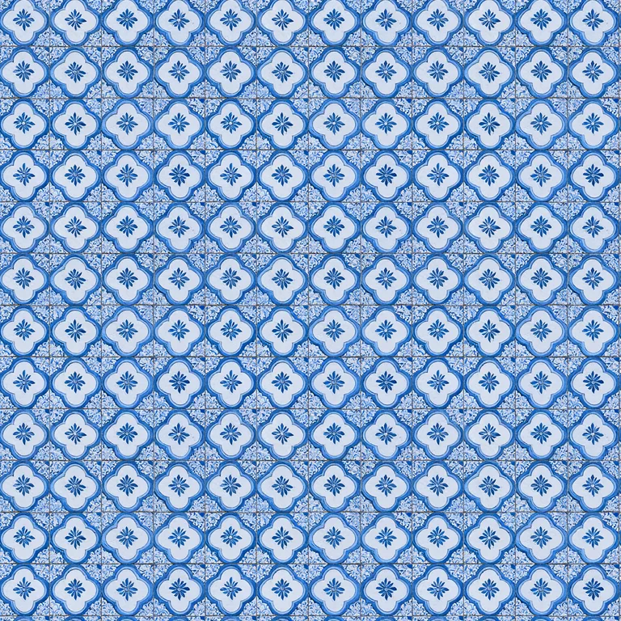</td>
</tr>
</table>

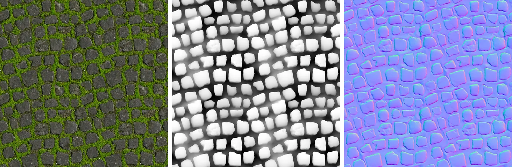<br>
<b>Texture maps</b>: a stone tile, then a height map and a normal map made from it with an edit. Each is shown
repeated 2x2: they all stay seamless.

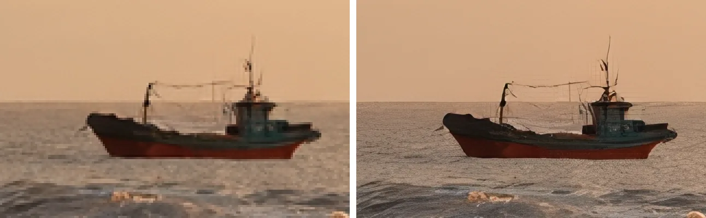<br>
<b>Upscaling</b> 4x. Left: plain enlargement. Right: the upscaler.

<details>
<summary>Prompts and settings</summary>

| Image | Tool and settings | Prompt |
|---|---|---|
| Text to image | `generate_image`, 1344x768, seed 20261006 | A lighthouse on a rocky coast at sunset, waves breaking on the rocks, warm golden light, a small fishing boat in the distance, dramatic clouds, photorealistic |
| Edit | `edit_image` with the image above, seed 7 | Make it a snowy winter night with the lighthouse beam switched on and snow on the rocks, keep everything else unchanged |
| Text in images | `generate_image`, 768x1024, seed 31 | A vintage travel poster, flat screen-print illustration of snowy mountains above a lake with a red train on a bridge, bold title text at the top that reads "SEE THE ALPS", smaller text at the bottom that reads "By rail, every season" |
| Uncensored | `generate_image`, 768x1024, seed 505 | Iron Man in his red and gold armor standing on a rooftop at night, city lights below, cinematic lighting, photorealistic |
| Icon | `generate_image`, 1024x1024, `transparent: true`, seed 404 | A cute cartoon rocket ship, flat vector illustration, bold outlines, bright colors |
| Transparent | `generate_image`, 1024x1024, `transparent: true`, seed 11 | A red fox sitting, full body, soft studio light |
| 360 panorama | `generate_panorama`, 2048x1024, seed 2026 | A mountain meadow with wildflowers, a stone cabin, a wooden boardwalk and a lake |
| Brick | `generate_image`, 512x512, `tileable: true`, seed 111 | Large red bricks with light grey mortar, close-up, photorealistic, even lighting |
| Wood | `generate_image`, 512x512, `tileable: true`, seed 222 | Wide oak floor planks with visible wood grain and knots, top-down, natural light |
| Ceramic | `generate_image`, 512x512, `tileable: true`, seed 303 | Blue and white ceramic tiles with a floral pattern |
| Stone tile | `generate_image`, 512x512, `tileable: true`, seed 512 | A moss-covered stone floor, top-down |
| Height map | `edit_image` with the stone tile, seed 1 | Convert `<image1>` into a grayscale height map for a game material: white = high stone tops, black = low grout and gaps, keep the exact layout of every stone |
| Normal map | `edit_image` with the stone tile, seed 2 | Convert `<image1>` into a normal map for a game material, keep the exact layout of every stone |
| Upscaling | `upscale_image`, `scale: 4` on the text-to-image result | - |

Characters and brands shown belong to their owners.

</details>

## Requirements

| | GPU mode | CPU mode |
|---|---|---|
| Docker | Docker Desktop (Windows, macOS) or Docker Engine with Compose (Linux) | same |
| Hardware | NVIDIA GPU, RTX 20xx or newer, 12 GB VRAM or more (see [GPU memory](#gpu-memory)), 32 GB RAM recommended | Any modern 64-bit CPU, 24 GB RAM or more |
| Driver | NVIDIA driver 570 or newer | - |
| Disk | About 12 GB for models and 6 GB for the Docker image | About 12 GB and 1 GB |

**GPU setup**

- **Windows**: install [Docker Desktop](https://docs.docker.com/desktop/setup/install/windows-install/) with the
  WSL 2 backend and a current NVIDIA driver.
- **Linux**: install the NVIDIA driver and the
  [NVIDIA Container Toolkit](https://docs.nvidia.com/datacenter/cloud-native/container-toolkit/latest/install-guide.html).

Check that Docker can see your GPU:

```bash
docker run --rm --gpus all nvidia/cuda:12.8.2-base-ubuntu24.04 nvidia-smi
```

### GPU memory

Every feature, including 2048x2048 images, edits with 10 input images, 2880x1440 panoramas and upscaling to
8192 px, works on a single 12 GB card:

| GPU memory | Settings | Notes |
|---|---|---|
| 24 GB or more | default | Everything stays on the GPU, the fastest setup. Peak use is about 18 GB |
| 12-16 GB | the settings below | Peak use is about 11 GB. The text encoder's weights stay in system RAM, so the server uses up to about 15 GB of RAM |
| 8-10 GB | `offload: cpu` and smaller sizes | Not tested. All weights stream from RAM: slower, and the largest sizes may not fit |

Settings for a 12 GB card, in `config.yaml`:

```yaml
gpu:
  max_vram_gb: {0: 10}
  offload: {text_encoder: cpu}
generation:
  prefix_cache_type: q8_0
```

## Quick start

```bash
git clone https://github.com/hypersniper05/MCP-Image-Generator-Uncensored.git
cd MCP-Image-Generator-Uncensored
./start.sh            # Linux / macOS
```

```powershell
.\start.cmd           # Windows (or double-click start.cmd)
```

The first start builds the Docker image (10-30 minutes) and downloads about 12 GB of models. When it is
ready, the script prints the address:

```
Ready. MCP endpoint (Streamable HTTP, no auth):
    http://localhost:5005/mcp
```

- **Stop**: `./stop.sh` or `stop.cmd`. **Logs**: `docker compose logs -f`.
- **Web page**: open `http://localhost:5005/` to see the status, upload images and browse recent results.
- **Settings**: the first start creates `config.yaml` from [`config.example.yaml`](config.example.yaml). To
  run on the CPU, set `device: cpu` in `config.yaml` and run the start script again.
- **Updates**: after pulling new code, run `./start.sh --build` (or `start.cmd -Build`) to rebuild the image.

<details>
<summary>Start without the scripts</summary>

```bash
cp config.example.yaml config.yaml
cp .env.example .env                  # for CPU mode, set COMPOSE_PROFILES=cpu in .env
docker compose up -d --build
```

</details>

> The server has **no authentication** and listens on all network interfaces, so other computers on your
> network can reach it at `http://<this-computer's-ip>:5005/mcp`. Only run it on a network you trust.

## Connect an MCP client

The endpoint is `http://<host>:5005/mcp` (Streamable HTTP).

**MCP Inspector** (quick test in a browser): run `npx @modelcontextprotocol/inspector`, choose
*Streamable HTTP*, enter `http://localhost:5005/mcp` and click *Connect*.

**VS Code** (`.vscode/mcp.json`):

```json
{ "servers": { "imagegen": { "type": "http", "url": "http://localhost:5005/mcp" } } }
```

**Cursor** (`~/.cursor/mcp.json`) and most other clients:

```json
{ "mcpServers": { "imagegen": { "url": "http://localhost:5005/mcp" } } }
```

**Clients that only support stdio** can connect through [mcp-remote](https://www.npmjs.com/package/mcp-remote):

```json
{ "mcpServers": { "imagegen": { "command": "npx", "args": ["-y", "mcp-remote", "http://localhost:5005/mcp", "--allow-http"] } } }
```

Large images take minutes. If an image is not ready within 50 seconds, the tool returns a `job_id` and the
client gets the image later with `get_job`, so clients with short timeouts still work.

<details>
<summary>llama.cpp web UI and optional request headers</summary>

For the llama.cpp web UI (llama-server started with `--ui-mcp-proxy`), add the server in the web UI's MCP
settings, or for every browser through the file passed with `--ui-config-file`:

```json
{
  "mcpServers": "[{\"id\": \"imagegen\", \"name\": \"Image Gen\", \"url\": \"http://127.0.0.1:5005/mcp\", \"enabled\": true, \"useProxy\": true, \"headers\": \"{\\\"X-Imagegen-Max-Wait\\\": \\\"20\\\", \\\"X-Inline-Max-Bytes\\\": \\\"16000000\\\"}\"}]"
}
```

Optional headers a client can send:

| Header | Effect |
|---|---|
| `X-Imagegen-Max-Wait: 20` | Wait at most this many seconds before returning a `job_id` |
| `X-Inline-Max-Bytes: 16000000` | Send the full image inline instead of a preview (for clients without a message size limit) |
| `X-Imagegen-Inline: data-uri-text` | Return images as data-URI text, for clients that drop MCP image content |
| `X-Forwarded-Host: 192.168.1.50:5005` | Host name to use in returned links when the client connects through a proxy |

</details>

## Tools

| Tool | What it does |
|---|---|
| `generate_image` | Text to image. Options: `size` (`small`, `medium`, `large`, `xl`) or `width` and `height`, `aspect_ratio`, `transparent`, `tileable`, `seed`, `steps`, `negative_prompt` |
| `edit_image` | Edit one image or combine up to 10 (refer to them as `<image1>`, `<image2>`, ...). Optional `mask`. Edits of a seamless tile stay seamless and keep its size |
| `generate_panorama` | 360 panorama (2:1). Optional `image` to turn a photo into a full 360 |
| `remove_background` | Cut out the subject into a transparent PNG |
| `upscale_image` | Enlarge 2x or 4x (up to 8192 px per side). Panoramas and tiles stay seamless |
| `remove_watermark` | Remove watermarks, logos and overlaid text; the rest of the image is kept as it was |
| `get_job`, `cancel_job` | Get the result of, or cancel, a job that was still running |
| `list_images`, `view_image` | Recent results and uploads, and a way for the model to look at one |
| `server_status` | Model, GPU placement, download progress and running jobs |

**Input images** can be a data URL or base64, an `http(s)` URL, a file name or link of an image this server
made, or an image uploaded on the server's web page (`http://<host>:5005/upload`).

**Results** include the image (or a preview of a large one) and a link to the full file, which is saved in
`./outputs`. Panoramas also get a link to the 360 viewer.

**Tips**

- For the best quality use `size: "xl"`. Leave `steps` and `cfg_scale` unset.
- Write full sentences: subject, setting, lighting, style. Put text that should appear in quotes:
  `a neon sign that says "OPEN 24/7"`.
- For edits, say what to change and add "keep everything else unchanged".
- For tiles, describe a surface or pattern that fills the whole picture, e.g. "moss-covered cobblestones,
  top-down".

## Configuration

All settings are in `config.yaml` (created from the commented [`config.example.yaml`](config.example.yaml)).
Restart after a change: `docker compose restart`. The most useful ones:

| Setting | Default | What it does |
|---|---|---|
| `device` | `gpu` | `gpu` or `cpu` |
| `model.quant` | `Q4_K_M` | Model size: `Q4_K_M` (4.6 GB), `Q6_K` (5.9 GB) or `Q8_0` (7.6 GB) |
| `generation.steps` | 40 | Quality vs. speed. 25 is a faster draft |
| `generation.default_size` | 1024x1024 | Size when a request gives none |
| `generation.panorama_size` | 2048x1024 | Default panorama size (2880x1440 at most) |
| `generation.wait_seconds` | 50 | How long a tool waits before returning a `job_id` |
| `generation.idle_unload_seconds` | 0 | Free the GPU memory after this many idle seconds (0 = keep loaded) |
| `outputs.keep_days` | 7 | Delete old results after this many days (0 = never) |
| `server.port` | 5005 | Port of the server |
| `server.public_url` | empty | Address used in returned links, e.g. `http://192.168.1.50:5005` |

`.env` (created from [`.env.example`](.env.example)) holds Docker settings such as `PUBLIC_URL`, `HF_TOKEN`
(only needed if Hugging Face rate-limits your downloads) and the build options.

`config.yaml` and `.env` are your local files and are not part of the repository.

## Choosing GPUs

GPU numbers are the ones `nvidia-smi` shows. Everything runs on GPU 0 by default. The model has three parts,
and each can go on a different GPU:

```yaml
gpu:
  diffusion: [0]     # the main model, runs every step: use the fastest GPU
  text_encoder: 1    # reads the prompt once per request
  vae: 0             # turns the result into pixels
```

On a shared computer, only the GPUs you list are used. For cards with less memory, see
[GPU memory](#gpu-memory).

## Troubleshooting

- **No GPU found**: run the `nvidia-smi` check from [Requirements](#requirements). On Linux, install the NVIDIA
  Container Toolkit. Or use `device: cpu`.
- **Out of GPU memory**: use the [12 GB settings](#gpu-memory), a smaller size, or move the text encoder to
  another GPU.
- **The client times out**: lower `generation.wait_seconds` below the client's timeout.
- **Other computers cannot connect**: use this computer's IP address instead of `localhost`, allow port 5005
  in the firewall, and set `server.public_url` so image links work.
- **CPU mode is very slow or crashes on Windows**: Docker Desktop gives WSL only half your RAM. Raise it in
  `%UserProfile%\.wslconfig` (`[wsl2]` then `memory=24GB`), run `wsl --shutdown` and restart Docker Desktop.
- **The server shows an error**: read `docker compose logs --tail 100`, fix the cause, and run the start
  script again.

## Development

```bash
python -m venv .venv && . .venv/bin/activate
pip install -e ".[test]"
pytest
```

`python -m imagegen_mcp --config config.yaml --check` validates a config file without starting anything.
`python scripts/smoke_test.py http://localhost:5005/mcp` tests a running server.

Images are made by [stable-diffusion.cpp](https://github.com/leejet/stable-diffusion.cpp), built inside the
Docker image from a pinned release with one small patch
([`docker/patches/sdcpp-circular-json.patch`](docker/patches/sdcpp-circular-json.patch)) that turns on its
wrap-around mode per request for tileable images.

## Credits and licenses

The code in this repository is MIT licensed (see [LICENSE](LICENSE)). It builds on the work of others; the
model files are downloaded from their original sources and keep their own licenses:

| Part | By | License |
|---|---|---|
| [Qwen-Image-2.1](https://huggingface.co/Qwen) image model | Qwen team, Alibaba | Qwen Research License (**non-commercial**) |
| [Uncensored Qwen-Image-2.1 GGUF](https://huggingface.co/abenzerps/Qwen-Image-2.1-Uncensored-GGUF) (the default model files) | abenzerps | Qwen Research License (**non-commercial**) |
| [Texture-fix VAE](https://huggingface.co/madebyollin/texture-fix-vae-for-qwen-image-2.1) (image decoder) | madebyollin | Qwen Research License (**non-commercial**) |
| [Qwen3-VL-8B-Instruct GGUF](https://huggingface.co/Qwen/Qwen3-VL-8B-Instruct-GGUF) (prompt and image encoder) | Qwen team, Alibaba | Apache-2.0 |
| [Watermark removal LoRA](https://civitai.com/models/2969142?modelVersionId=3364468) (v1.0 for Qwen 2.1) | saladin | Civitai license: **no commercial use** |
| [BiRefNet](https://github.com/ZhengPeng7/BiRefNet) background removal, via [rembg](https://github.com/danielgatis/rembg) | Peng Zheng et al.; Daniel Gatis | MIT (the optional `isnet-general-use` model: Apache-2.0) |
| [4xNomos2_otf_esrgan](https://huggingface.co/Phips/4xNomos2_otf_esrgan) upscaler ([models](https://github.com/Phhofm/models)) | Philip Hofmann | [CC BY 4.0](https://creativecommons.org/licenses/by/4.0/) |
| [Real-ESRGAN](https://github.com/xinntao/Real-ESRGAN) (`RealESRGAN_x4plus`, optional upscaler) | Xintao Wang | BSD-3-Clause |
| [stable-diffusion.cpp](https://github.com/leejet/stable-diffusion.cpp) and ggml (the inference engine) | leejet and contributors | MIT |
| [Pannellum](https://pannellum.org) (the 360 viewer) | Matthew Petroff | MIT |

The Qwen-Image-2.1 files allow non-commercial use only: read their license before using images commercially.
Only remove watermarks from images you have the rights to edit. The `:gpu` Docker image is based on NVIDIA's
CUDA image ([license](https://developer.nvidia.com/ngc/nvidia-deep-learning-container-license)).

The uncensored model has no built-in content filter. You are responsible for how you use it and what you make
with it.
